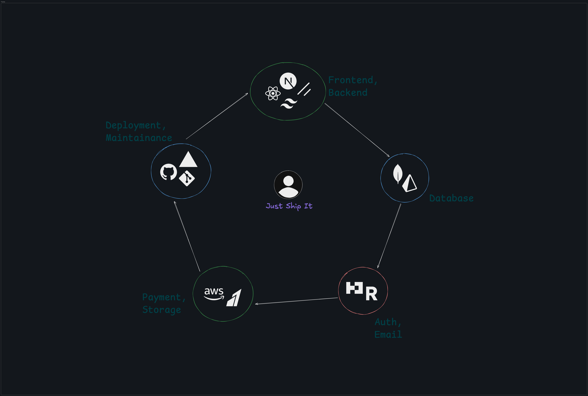

<div align="center">
  
</div>

The NextJS boilerplate with all you need to build your SaaS or any other web app and make your first $ online fast.

## ✨ Features

- **🔐 Authentication System**

  - Email-based authentication with verification
  - Session management with secure tokens
  - Protected routes and middleware

- **📁 File Management**

  - Drag & drop file uploads
  - AWS S3 integration for cloud storage
  - File deletion and management
  - Multiple file type support

- **🎯 Onboarding Flow**

  - User onboarding wizard
  - Form validation with Zod schemas
  - Progressive user experience

- **🎨 Modern UI/UX**
  - Beautiful, responsive design
  - Component-based architecture
  - Tailwind CSS styling

## 🛠️ Tech Stack

### Frontend

- **Next.js 15** - React framework with App Router
- **React 19** - Latest React with concurrent features
- **TypeScript** - Type-safe development
- **Tailwind CSS 4** - Utility-first CSS framework
- **Shadcn UI** - Accessible component primitives
- **Lucide React** - Beautiful icons
- **React Hook Form** - Form handling and validation
- **Zod** - Schema validation

### Backend & Database

- **Next.js API Routes** - Serverless API endpoints
- **Prisma** - Database ORM with PostgreSQL
- **PostgreSQL** - Relational database
- **Better Auth** - Authentication library

### Cloud & Services

- **AWS S3** - File storage and management
- **Resend** - Email service for verification
- **Vercel** - Deployment platform

### Development Tools

- **ESLint** - Code linting
- **Prettier** - Code formatting
- **Turbopack** - Fast development bundler

## 🏗️ Project Structure

```
shipfast/
├── app/                          # Next.js App Router
│   ├── (home)/                  # Public home page
│   ├── (protected)/             # Protected routes
│   │   ├── dashboard/           # User dashboard
│   │   └── onboarding/          # User onboarding
│   ├── api/                     # API endpoints
│   │   ├── auth/                # Authentication routes
│   │   └── s3/                  # File management routes
│   ├── auth/                    # Authentication pages
│   │   ├── login/               # Login page
│   │   └── verify/              # Email verification
│   └── layout.tsx               # Root layout
├── components/                   # Reusable components
│   └── ui/                      # UI component library
├── hooks/                       # Custom React hooks
├── lib/                         # Utility libraries
│   ├── auth.ts                  # Authentication utilities
│   ├── aws.ts                   # AWS S3 configuration
│   ├── db.ts                    # Database configuration
│   └── utils.ts                 # Helper functions
├── modules/                     # Feature modules
│   ├── auth/                    # Authentication components
│   ├── file-upload/             # File upload components
│   └── onboarding/              # Onboarding components
├── prisma/                      # Database schema and migrations
└── public/                      # Static assets
```

## 🚀 Getting Started

### Prerequisites

- Node.js 18+
- pnpm (recommended) or npm
- MongoDB database
- AWS S3 bucket
- Resend account for emails

### Installation

1. **Clone the repository**

   ```bash
   git clone <your-repo-url>
   cd shipfast
   ```

2. **Install dependencies**

   ```bash
   pnpm install
   ```

3. **Set up environment variables**
   Create a `.env.local` file:

   ```env
   DATABASE_URL=

   RESEND_API_KEY=

   BETTER_AUTH_SECRET=
   BETTER_AUTH_URL=

   GITHUB_CLIENT_ID=
   GITHUB_CLIENT_SECRET=

   AWS_ACCESS_KEY_ID=
   AWS_SECRET_ACCESS_KEY=
   AWS_ENDPOINT_URL_S3=
   AWS_ENDPOINT_URL_IAM=
   AWS_REGION=

   NEXT_PUBLIC_AWS_BUCKET_NAME=
   ```

4. **Set up the database**

```bash
pnpm prisma:generate
pnpm prisma:push
```

5. **Run the development server**

   ```bash
   pnpm dev
   ```

6. **Open your browser**
   Navigate to [http://localhost:3000](http://localhost:3000)

## 📝 Available Scripts

- `pnpm dev` - Start development server with Turbopack
- `pnpm build` - Build for production
- `pnpm start` - Start production server
- `pnpm lint` - Run ESLint
- `pnpm prisma:generate` - Generate Prisma client
- `pnpm prisma:push` - Push schema to database
- `pnpm prisma:studio` - Open Prisma Studio

## 🌟 Key Features Explained

### Authentication Flow

The app uses Better Auth for secure authentication with email verification. Users can sign up, verify their email, and access protected routes.

### File Upload System

Integrated with AWS S3 for scalable file storage. Features drag-and-drop interface with progress indicators and file management.

### Onboarding Experience

Guided user onboarding with form validation and progressive disclosure to improve user experience.

## 🚀 Deployment

The easiest way to deploy is using [Vercel](https://vercel.com):

1. Push your code to GitHub
2. Import your project to Vercel
3. Add your environment variables
4. Deploy!

## 🤝 Contributing

1. Fork the repository
2. Create a feature branch
3. Make your changes
4. Add tests if applicable
5. Submit a pull request

## 📄 License

This project is licensed under the MIT License.

## 🙏 Acknowledgments

- Built with [Next.js](https://nextjs.org/)
- UI components from [Radix UI](https://www.radix-ui.com/)
- Styling with [Tailwind CSS](https://tailwindcss.com/)
- Icons from [Lucide](https://lucide.dev/)

---

<div align="center">
  <strong>Ship your ideas fast with ShipFast! 🚀</strong>
</div>
